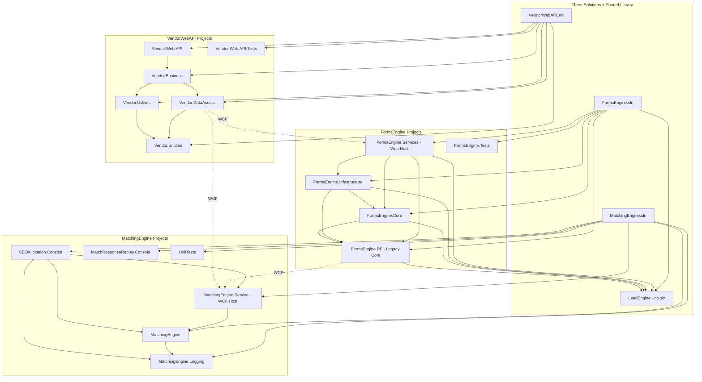
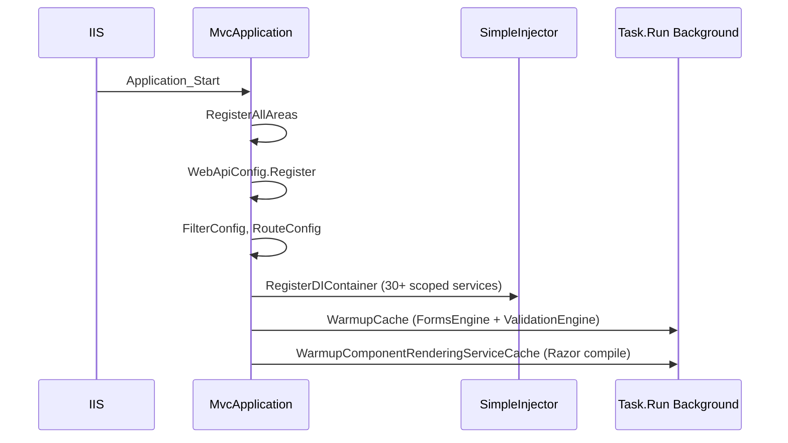
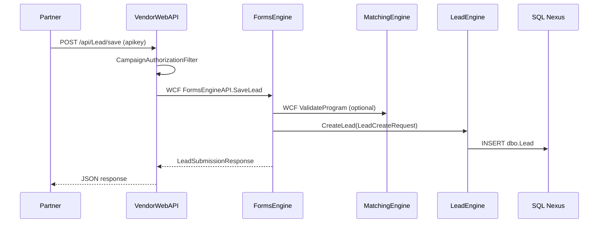
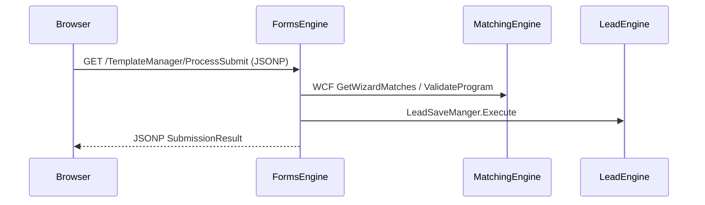

# Architecture

## Architecture Style

This platform uses a **hybrid layered monolith** architecture across multiple IIS-hosted applications. It is **not** Clean Architecture, microservices, or event-driven in the modern sense.

| Pattern | Where Applied | Evidence |
|---------|---------------|----------|
| **Layered (n-tier)** | VendorWebAPI: Web.API → Business → DataAccess → Entities | Project structure in `VendorWebAPI/EDDY.IS.Vendor.Web.API.sln` |
| **Partial Clean Architecture** | FormsEngine School Picker: Core (interfaces/services) → Infrastructure (repositories) → Services (host) | `EDDY.IS.FormsEngine.Core`, `EDDY.IS.FormsEngine.Infastructure` |
| **Legacy Facade + Data Services** | FormsEngine RF, MatchingEngine, LeadEngine | `FormsEngine.cs`, `*DataService.cs` classes |
| **WCF Service-Oriented** | Inter-application communication | `MatchingService.svc`, `FormsEngineAPI.svc`, WCF client references |
| **Rules Engine / Strategy** | MatchingEngine eligibility rules | `RulesEngine.cs`, `Rules/StandardRules/*` |
| **Repository (informal)** | Infrastructure repos, Vendor DAOs | `I*Repository` in Core; `*DAO` in VendorWebAPI |
| **Chain of Responsibility** | SEO allocation pipeline | `AllocationProcessManager`, `*ProcessStep` classes |

### Why It Was Built This Way

1. **Historical .NET Framework era** (2010s) — WCF was the standard for internal service communication; EF Database First from existing Nexus schema
2. **Performance requirements** — MatchingEngine loads entire campaign/inventory into memory (`MatchingEngineCache.PreloadEntireCache`) to avoid per-request DB round-trips
3. **Partner embedding model** — FormsEngine serves JSONP to cross-origin partner sites, driving MVC + GET-heavy API design
4. **Incremental refactor** — Core/Infrastructure layer added for School Picker without rewriting the legacy `FormsEngine` facade

---

## Solution Dependency Graph

---

## Startup Sequence

### FormsEngine (`Global.asax.cs`)

**Reference:** `FormsEngine/EDDY.IS.FormsEngine.Services/Global.asax.cs` lines 25-38, 45-70, 72-119.

### MatchingEngine (`MatchingEngineStartup`)

1. `MatchingEngineStartup.AppInitialize()` calls `StaticCacheProxyHost.CacheProxy.PreloadEntireCache()`
2. `Parallel.ForEach` loads 60+ cache items from Nexus SQL views
3. First WCF request served from warm cache

**Reference:** `MatchingEngine/EDDY.IS.MatchingEngine.Service/App_Code/MatchingEngineStartup.cs`, `MatchingEngine/EDDY.IS.MatchingEngine/MatchingEngineCache.cs`.

**Confidence note:** Wiring of `AppInitialize` to IIS application start is not explicit in `Web.config` in-repo; may use external warm-up or first-request lazy load.

### VendorWebAPI (`Global.asax.cs`)

1. `Application_Start` → areas, Web API, MVC filters/routes/bundles
2. `VendorBase.LoadSupportingCache()` — loads vendors, categories, states, programs into `MemoryCache` (24h TTL)

**Reference:** `VendorWebAPI/EDDY.IS.Vendor.Web.API/Global.asax.cs`.

### LeadEngine

No startup — class library loaded by host process.

---

## Application Lifecycle

| Phase | FormsEngine | MatchingEngine | VendorWebAPI |
|-------|-------------|----------------|--------------|
| **Request ingress** | MVC route `{controller}/{action}` | WCF `MatchingService.svc` | Web API `api/{controller}/{action}` |
| **Auth** | None (public JSONP) | None (network perimeter) | `CampaignAuthorizationFilter` (apikey GUID) |
| **Business logic** | Controller → FormsEngine facade OR DI services | WCF → MatchingEngine → RulesEngine | Controller → Business → DAO → WCF |
| **Persistence** | EF6 + WCF downstream | Async logging to EddyTracking | EF6 Nexus + EddyLogging |
| **Response** | JSONP / partial views | JSON-wrapped WCF | JSON `VendorResponseBase` |
| **Background** | `Task.Run` lead saves | `Task.Run` match logging | Cache refresh callbacks |

---

## Architectural Violations

| Violation | Location | Description |
|-----------|----------|-------------|
| **Dual architecture in one app** | FormsEngine | Legacy `FormsEngine` partial + new Core/Infrastructure coexist; most traffic still hits legacy path |
| **Controller god classes** | `TemplateManagerControllerBase` | Business logic, WCF calls, session management in controller base |
| **Leaky abstraction** | Infrastructure repositories | Repositories delegate directly to legacy `FormsEngine` static methods and WCF clients |
| **Anemic DI** | FormsEngine | Only 2 controllers registered in SimpleInjector; rest use parameterless constructors |
| **No interface segregation** | VendorWebAPI Business | Business classes instantiate concrete DAOs directly |
| **Cross-layer DTO sharing** | LeadEngine DTOs used in FormsEngine controllers | Tight compile-time coupling |
| **GET mutations** | FormsEngine `ProcessSubmit`, `SaveProspect` | State-changing operations via HTTP GET |
| **Synchronous blocking in async paths** | Various `Task.Run` without `ConfigureAwait` or error propagation | Fire-and-forget anti-pattern |
| **Security boundary at network only** | MatchingEngine WCF | `includeExceptionDetailInFaults`, metadata enabled, no auth |
| **Configuration as secrets store** | All `Web.config` files | Auth tokens, API keys in plaintext appSettings |

---

## Cross-Cutting Concerns

| Concern | Implementation |
|---------|----------------|
| **Logging** | `EDDY.IS.Core.Logging.ISException`, `PerformanceLog`, Enterprise Library (`VendorWebAPI`) |
| **Exception handling** | Global `HandleErrorAttribute` (MVC); `EDDY.IS.Common.ExceptionHandler` (VendorWebAPI) |
| **Caching** | `EDDY.IS.LocalCache.LocalCacheBase`, `HttpRuntime.Cache`, Redis, `MemoryCache` |
| **Validation** | `EDDY.IS.Validation.ValidationEngine` (shared NuGet), action filters (VendorWebAPI) |
| **Mapping** | Manual mappers, AutoMapper (VendorWebAPI, partially), T4 templates (FormsEngine RF DTOs) |

---

## Communication Patterns Between Subsystems

**Direct browser path (no VendorWebAPI):**

See [Diagrams/](./Diagrams/) for additional sequence, class, and dependency diagrams.
