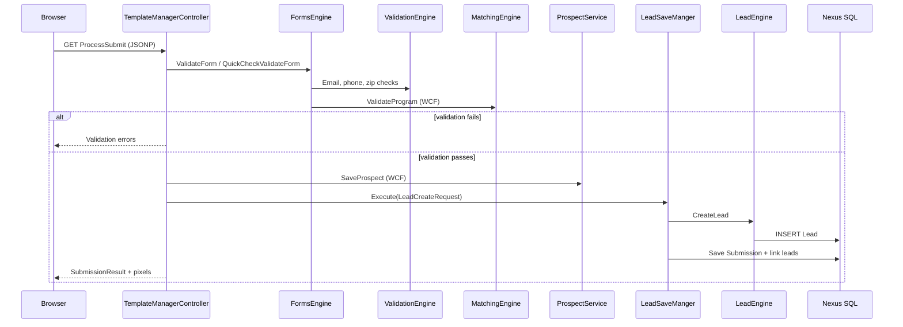
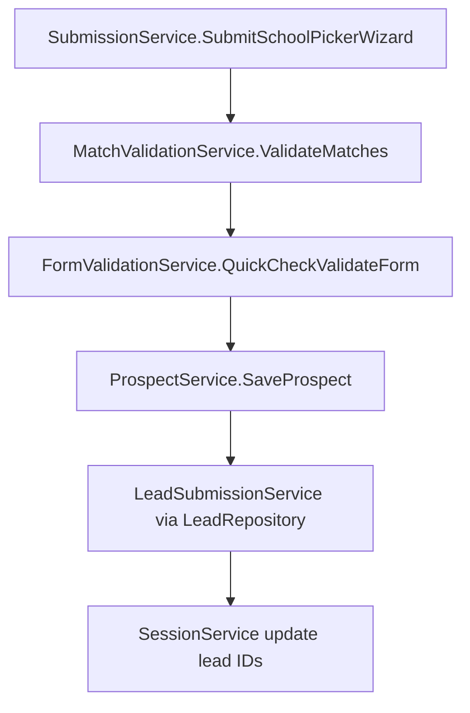

# Business Logic Documentation

This document catalogs major business processes across all subsystems. Each process includes inputs, outputs, validation, rules, failure handling, and related code references.

---

## Process Index

| # | Process | Primary Subsystem |
|---|---------|-------------------|
| 1 | Program Template Form Submission | FormsEngine |
| 2 | Wizard / Managed Choice Flow | FormsEngine |
| 3 | School Picker Wizard Submission | FormsEngine |
| 4 | Form Field Validation | FormsEngine |
| 5 | Program/School Matching | MatchingEngine |
| 6 | Cross-Sell Matching | MatchingEngine |
| 7 | Program Validation (EPLite/Warm Transfer) | MatchingEngine |
| 8 | Lead Creation & Delivery Status Assignment | LeadEngine |
| 9 | Prospect Save & Wizard Status | FormsEngine → Prospect Service |
| 10 | Partner Lead API Submission | VendorWebAPI |
| 11 | EMS Lead Update | VendorWebAPI |
| 12 | SEO Allocation Batch | MatchingEngine |
| 13 | Session State Management | FormsEngine |
| 14 | Host-and-Post Lead | FormsEngine / VendorWebAPI |

---

## 1. Program Template Form Submission

### Purpose
Capture a prospective student's inquiry on a single-program or multi-field form embedded on a partner site.

### Inputs
- `FormRequest` with template ID, campaign track ID, form field values, session ID
- Source: `GET /TemplateManager/ProcessSubmit`

### Outputs
- `SubmissionResultDTO` (JSONP): lead IDs, validation errors, thank-you redirect data, pixel firing instructions

### Validation
1. Client-side: `/FormValidation/*` endpoints (email, phone, zip, profanity)
2. Server-side: `FormsEngine.ValidateForm` / `QuickCheckValidateForm` when `WebLeadsServerSideValidationEnabled=true`
3. Program validation via MatchingEngine `ValidateProgram`

### Business Rules
- `LeadCreationType.InstitutionFormInitial` (value 1) for standard forms
- Test leads: `LastName == "test"` OR email contains `@test.com` → status `EDDY_FORM_TEST_LEAD` (470)
- Spam leads: status `SPAM` (1003) unless `IsSpamAllowedForDelivery=true`
- Failed SSV → `EDDY_FORM_VALIDATION_FAILED` (430) or product-specific codes

### Edge Cases
- Duplicate leads detected by validation engine
- No program matches → `GetNoMatch` flow
- Cross-sell available → `CrossSellLeadSubmission` alternate path
- Realtime vs async delivery paths in `LeadSaveManger`

### Failure Handling
- Validation errors returned in response; no lead created
- Exceptions logged via `ISException` with `ISApplication.FormsEngine`
- Async save failures in `Task.Run` are swallowed (logged only)

### Related Classes
- `TemplateManagerControllerBase.ProcessSubmit`
- `FormsEngine` (partial), `LeadSaveManger`, `EntityBuildHelper`
- `LeadEngine.CreateLead`, `LeadDataService.SaveLead`

### Related Database Tables
- `dbo.Submission`, `dbo.SubmissionDetail`, `dbo.SubmissionMatchResponse`
- `dbo.Lead` (via LeadEngine)
- `dbo.Template`, `dbo.TemplateControl`

### Sequence Diagram

---

## 2. Wizard / Managed Choice Flow

### Purpose
Multi-step form where student answers questions, receives smart-matched schools, selects preferences, and may be routed to call center (Five9).

### Inputs
- Wizard template ID, progressive form answers in `FESession`
- Endpoints: `GetWizardTemplate`, `GetMatchingEngineWizardResponse`, `GetManagedChoice`, `ManagedChoiceLeadSubmission`

### Outputs
- Wizard HTML/JS, match carousel, managed choice UI, lead IDs, dialer routing result

### Validation
- `AnySchoolMatches` pre-check before showing additional questions
- Per-program validation during user selection phase
- Mobile number check: `CheckMobileNumbers`

### Business Rules
- `LeadCreationType.WizardSmartMatch` (3) or `WizardUserSelection` (4)
- Five9 dialer routing via `ProcessDialerRoute` when managed choice completes
- Prospect wizard status: matched vs limbo states via `SaveProspectWizardStatus`
- Warm Transfer Titanium product (ProductId 52) → hold status

### Edge Cases
- Zero smart matches → limbo track retry with alternate `TrackId`
- User abandons mid-wizard → session expires per cache TTL
- Cross-sell after wizard completion

### Failure Handling
- `GetNoMatch` page for zero matches
- Failed match replacements in School Picker (separate flow)

### Related Classes
- `FormsRelatedServices.MatchingEngine.cs` — `GetWizardMatches`
- `FormsRelatedServices.Five9.cs`, `FormsRelatedServices.Prospect.cs`
- `TemplateManagerControllerBase` (managed choice methods)

---

## 3. School Picker Wizard Submission

### Purpose
Newer DI-based flow for school picker UI where user selects from matched schools.

### Inputs
- `FormRequest` → `SchoolPickerWizardSubmission`
- `GET /Submission/SubmitSchoolPickerWizard`

### Outputs
- `SubmissionResponse` with lead IDs, validated programs, thank-you data

### Pipeline (explicit in code)

**Reference:** `FormsEngine/EDDY.IS.FormsEngine.Core/Services/SubmissionService.cs`

### Business Rules
- `LeadCreationType.SchoolPickerUserSelection` (12)
- Failed match replacements via `FailedMatchReplacementService` before submission
- `MatchValidationService` ensures selected programs still valid

---

## 4. Form Field Validation

### Real-Time Client Validation Endpoints

| Endpoint | Validation |
|----------|------------|
| `ProfanityCheck` | Profanity filter |
| `EmailCheck` / `EmailCheckEx` | DNS/MX + async xVerify |
| `PhoneNumberCheck` | Format + Targus lookup |
| `ZipCodeStateCountryCheck` | Zip-state-country consistency |
| `BirthDateCheck` | Age eligibility |
| `IsMobilePhone` | Mobile detection |

**Reference:** `FormsEngine/EDDY.IS.FormsEngine.Services/Controllers/FormValidationController.cs`

### VendorWebAPI Validation Filters

25+ action filters validate campaign type, TCPA consent, campus/category/subject existence, age, military affiliation, paging parameters.

**Reference:** `VendorWebAPI/EDDY.IS.Vendor.Web.API/Filters/`

---

## 5. Program/School Matching (Directory)

### Purpose
Given prospect criteria and campaign track ID, return ranked list of eligible institutions/programs.

### Inputs
- `DirectoryMatchRequest`: TrackGuid, ApplicationId, geo (zip/state/country), education level, category/subject/specialty filters, paging

### Outputs
- `InstitutionResponse`, `ProgramResponse`, `CampusResponse` with pagination, RPL, strategic scores

### Processing Steps
1. `Campaign.Get(trackGuid)` — resolve campaign configuration
2. `MatchDatabase.FilterProgramProducts` — inverted index narrowing
3. `RulesEngine` — apply eligibility rules (geo, caps, age, education, military, etc.)
4. `SchoolRankingEngine` — SRA scoring (eRPL, strategic weights, business model)
5. `MatchAggregator` — shape response DTOs
6. `MatchPersister` — async log to EddyTracking (unless `IsBeta`)

### Key Rules (non-exhaustive)
- `LeadCap`, `CRChannelCap` — volume caps
- `Country`, `State`, `ZipCode` — geographic eligibility
- `Age`, `EducationLevel`, `GPA` — demographic eligibility
- `CampusDistanceForSM` — smart match distance limit (`SM_MaxDistanceInMiles`)
- `LeadPing` — lead scoring tier restrictions

**Reference:** `MatchingEngine/EDDY.IS.MatchingEngine/Rules/StandardRules/`

### Failure Handling
- Empty result set returned (not an error)
- Rule failures tracked in `MatchResponseRemovalReason` logging tables
- External match fallback via `ThirdPartyMatchProcessor`

---

## 6. Cross-Sell Matching

### Inputs
- `CrossSellMatchRequest` with primary program selection, specialty/subject/category

### Outputs
- `CrossSellProgramResponse` with ranked cross-sell programs

### Rules
- `CrossSellProcessor` mapping cache drives specialty → subject → category backfill
- `LeadScoreReservation` tier restrictions
- `MaxProgramsToDisplay`, `MaxUserSelections` limits

**Reference:** `MatchingEngine/EDDY.IS.MatchingEngine/CrossSellProcessor.cs`, `MatchingEngine.GetProgramsForCrossSell`

---

## 7. Program Validation

### Purpose
Validate a specific program-product selection before lead submission.

### Inputs
- `ProgramValidateRequest` or `APIProgramValidateRequest`

### Outputs
- Validation result with pass/fail, alternate program suggestions, EPLite upsell, Warm Transfer Titanium paths

### Business Rules
- Failed validation may return alternate `ProgramProductId`
- LeadPing CPL lookup for scored matches
- EMS-specific rules: `EMSDefaultDuplicate`, `LenexaAgencyDuplicateByEmail`

**Reference:** `MatchingEngine/EDDY.IS.MatchingEngine.Service/MatchingService.svc.cs` — `ValidateProgram`, `ValidateAPIProgram`

---

## 8. Lead Creation & Delivery Status

### Purpose
Normalize form data and persist lead with appropriate realtime delivery status.

### Inputs
- `LeadCreateRequest` with case-insensitive dictionary `LeadData`, campaign track ID, match response GUID, creation type

### Status Assignment Logic (`CreateLeadDTO`)

| Condition | Status Code |
|-----------|-------------|
| ProductId == 52 (Titanium WT) | `WARM_TRANSFER_TITANIUM_HOLD` |
| Realtime delivery flag | `REALTIME` (101) |
| Failed server-side validation | `EDDY_FORM_VALIDATION_FAILED` (430) or variants |
| Duplicate | Duplicate-specific codes |
| Spam (unless allowed) | `SPAM` (1003) |
| Test lead | `EDDY_FORM_TEST_LEAD` (470) |
| Default pass | `NEW_PENDING` |

### Post-Create Update
- `UpdateLeads` links `SubmissionId`, `RawPostDataId` via stored procedure `Prod.EDDY_FE_Lead_Update`

**Reference:** `LeadEngine/EDDY.IS.LeadEngine-RF/LeadEngine.cs`, `LeadDataService.cs`

### Traceability
- `MatchResponseGuid` on `Lead` row links back to MatchingEngine result (no direct compile-time dependency)

---

## 9. Prospect Save

### Purpose
Create/update CRM prospect record before or during lead submission.

### External Service
- WCF `ProspectServiceClient` — `SaveProspect`, `SaveProspectWizardStatus`, `SaveProspectJobContactMe`

**Reference:** `FormsEngine/EDDY.IS.FormsEngine.RF/FormsRelatedServices.Prospect.cs`

### Async Paths
- `SaveProspectAsyncTask`, `SaveProspectWizardStatusAsync` via `Task.Run`

---

## 10. Partner Lead API Submission

### Purpose
Allow certified partners to submit leads programmatically.

### Flow
1. `POST /api/Lead/save` with `ContactRequest` + `apikey`
2. `CampaignAuthorizationFilter` validates campaign GUID, status, rate limits
3. Action filters: `PostLeadActionFilter`, `TCPAFilter`, `LeadSourceFilter`, etc.
4. `Leads.SaveLead` → `FormsServiceDAO.SaveLead` → FormsEngine WCF
5. Response logged to `EddyApiLog`

**Reference:** `VendorWebAPI/EDDY.IS.Vendor.Web.API/Controllers/LeadController.cs`

---

## 11. EMS Lead Update

### Purpose
Update existing EMS lead when partner sends changed data.

### Flow
1. `POST /api/Institutions/lead-update` with `LeadUpdateRequest`
2. `LeadUpdateValidationFilter`
3. `DataExchangeServiceDAO.LookUpLead` → `VW_EMSLead`
4. Diff detection → HTTP POST to EMS Lead Engine `processfromdataexchange`

**Reference:** `VendorWebAPI/EDDY.IS.Vendor.DataAccess/DataExchangeServiceDAO.cs`

---

## 12. SEO Allocation Batch

### Purpose
Analyze GradSchools Drupal sitemap nodes against matching inventory for SEO allocation reporting.

### Flow
1. `AllocationProcessManager.ProcessAllocation()`
2. Preload ME cache
3. Fetch nodes from `GS_URL/sitemap/get-nodes` (RestSharp)
4. Per node: `MatchingService.GetInstitutions` (app id 7)
5. Aggregate paid/free program counts, RPL sums
6. Persist `GSAllocationMaster` + `GSAllocationDetail`

**Reference:** `MatchingEngine/EDDY.IS.SEOAllocation.Console/Model/AllocationProcessManager.cs`

---

## 13. Session State Management

### Purpose
Maintain form state across multi-step flows for anonymous users.

### Implementation
- `FESession` class stores key-value pairs in `HttpRuntime.Cache`
- Extended via Redis in `SessionController` for cross-server scenarios
- Session keys defined in `FormsEngine/EDDY.IS.FormsEngine.Core/Constants.cs`

### Operations
- `GetSessionId`, `SetObject`, `GetObject`, `SetWorkflowStatus`, `GetFormSessionValues`

---

## 14. Host-and-Post Lead

### Purpose
Partner posts lead data directly without form rendering (API integrators, call centers).

### Entry Points
- FormsEngine: `TemplateManager/ProcessHostAndPostLead`
- VendorWebAPI: `CallCenterLeadController`, `MarketingController`
- `LeadCreationType.HostAndPost` (5)

### Validation
- `HostAndPostCampaignFilter` ensures campaign type supports host-and-post
