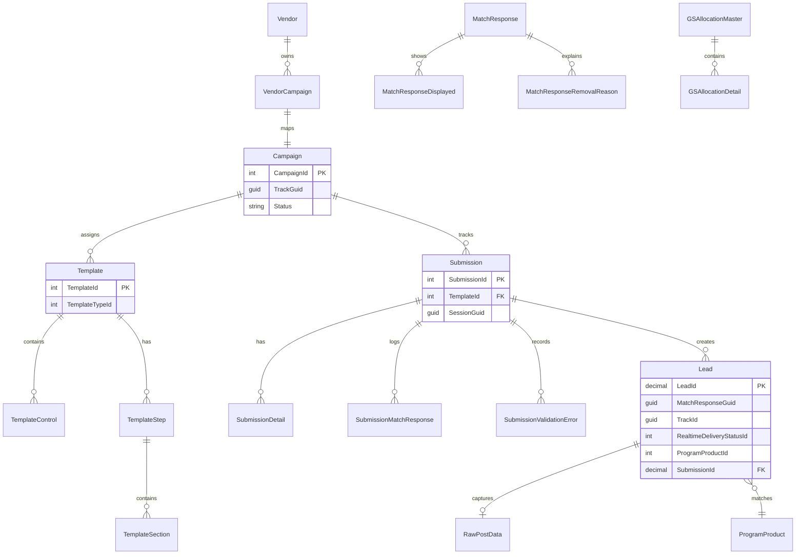

# Database Documentation

## Overview

The platform uses **SQL Server** as the primary data store across multiple databases. All access is via **Entity Framework 6 Database First** (EDMX) or raw ADO.NET `SqlDataReader`. There are **no EF Code First migrations** in this repository.

---

## DbContext Inventory

| DbContext | Project | Connection Name | Database | Purpose |
|-----------|---------|-----------------|----------|---------|
| `FEEntitiesContainer` | FormsEngine.RF | `FEEntitiesContainer` | Nexus | Templates, submissions, campaigns, controls |
| `Nexus_Lead_Entities` | LeadEngine | `Nexus_Lead_Entities` | Nexus | Lead, BetaLead, RawPostData |
| `Nexus_Validation_Entities` | *(NuGet Validation)* | `Nexus_Validation_Entities` | Nexus | Validation rules (external package) |
| `EddyLoggingEntities` | FormsEngine host | `EddyLoggingEntities` | EddyLogging | Exception/performance logs |
| `MatchingEngineModelContainer` | MatchingEngine | `MatchingEngineModelContainer` | Nexus | 60+ `VW_Matching_*` views |
| `MatchLoggingModelContainer` | MatchingEngine.Logging | `MatchLoggingModelContainer` | EddyTracking | Match response logging |
| `GSAllocationContextContainer` | SEOAllocation.Console | GS allocation connection | GS Allocation DB | SEO allocation results |
| `APINexusEntities` | VendorWebAPI | `APINexusEntities` | Nexus | Campaigns, vendors, programs, leads |
| `EddyLoggingEntities` | VendorWebAPI | `EddyLoggingEntities` | EddyLogging | API logs (`APILog`, `EddyApiLog`) |
| `MELog` | MatchResponseReplay | Replay config | EddyTracking | Historical match responses |

---

## Entity Relationship Diagram (Conceptual)

**Confidence:** High for Lead/Submission/Template (explicit EF mappings in EDMX). Medium for Campaign-VendorCampaign (inferred from DAO queries). Relationships between MatchingEngine views are **inferred from view naming** — the ME layer reads denormalized views, not normalized tables directly.

---

## FormsEngine Entities (FEEntitiesContainer)

### Tables (from EDMX SSDL)

| Entity | SQL Table/View | Purpose |
|--------|---------------|---------|
| `Submission` | `dbo.Submission` | Form submission record |
| `SubmissionDetail` | `dbo.SubmissionDetail` | Per-field submission data |
| `SubmissionDetailAdditional` | `dbo.SubmissionDetailAdditional` | Additional submission fields |
| `SubmissionMatchResponse` | `dbo.SubmissionMatchResponse` | Match engine response linkage |
| `SubmissionValidationError` | `dbo.SubmissionValidationError` | Validation failures |
| `SubmissionLeadScoringResponse` | `dbo.SubmissionLeadScoringResponse` | Lead scoring results |
| `Template` | `dbo.Template` | Form template definition |
| `TemplateControl` | `dbo.TemplateControl` | Form field controls |
| `TemplateControlDefault` | `dbo.TemplateControlDefault` | Default control values |
| `TemplateSection` | `dbo.TemplateSection` | Template sections |
| `TemplateStep` | `dbo.TemplateStep` | Wizard steps |
| `TemplateType` | `dbo.TemplateType` | Template type lookup |
| `TemplateAssignment` | `dbo.TemplateAssignment` | Template-to-campaign assignment |
| `TemplateApplicationOverride` | `dbo.TemplateApplicationOverride` | Per-app overrides |
| `StandardControl` | `dbo.StandardControl` | Reusable form controls |
| `StandardControlCode` | `dbo.StandardControlCode` | Control code definitions |
| `StandardControlGroup` | `dbo.StandardControlGroup` | Control grouping |
| `StandardControlType` | `dbo.StandardControlType` | Control types |
| `StandardControlDataType` | `dbo.StandardControlDataType` | Data types |
| `StandardControlValidation` | `dbo.StandardControlValidation` | Validation rules |
| `StandardControlCodeFilter` | `dbo.StandardControlCodeFilter` | Code filters |
| `Campaign` | `dbo.Campaign` | Campaign configuration |
| `KVCode` / `KVCodeData` | `dbo.KVCode*` | Key-value lookup codes |
| `HTMLRenderingStrategy` | `dbo.HTMLRenderingStrategy` | Rendering strategies |
| `HTMLRenderingStrategyAssignment` | `dbo.HTMLRenderingStrategyAssignment` | Strategy assignments |
| `ResourceMetaData` | `dbo.ResourceMetaData` | Localized text resources |
| `ProgramLevel` | `dbo.ProgramLevel` | Program levels |
| `ProgramProduct` | `dbo.ProgramProduct` | Program products |
| `ProgramTemplateMessage` | `dbo.ProgramTemplateMessage` | Template messages |
| `OpenMailProfile` / `OpenMailRule` | `dbo.OpenMail*` | OpenMail integration |
| `PreDefinedValueList` | `dbo.PreDefinedValueList` | Autocomplete lists |
| `ValidationLibrary` | `dbo.ValidationLibrary` | Validation definitions |
| `ValueList` | `dbo.ValueList` | Generic value lists |
| `ErrorCode` / `ErrorMessage` | `dbo.Error*` | Error catalog |

### Views

| View Entity | SQL View | Purpose |
|-------------|----------|---------|
| `VW_ProgramProductTemplate` | `VW_ProgramProductTemplate` | Program-template mapping |
| `VW_ProspectResubmissions` | `VW_ProspectResubmissions` | Resubmission candidates |
| `VW_LandingPageSettings` | `VW_LandingPageSettings` | Landing page config |
| `VW_EMSInstitutionTCPAMessages` | `VW_EMSInstitutionTCPAMessages` | EMS TCPA text |

### Stored Procedures

| Result Entity | Procedure | Purpose |
|---------------|-----------|---------|
| `EDDY_FE_GetCreativeURLs_Result` | `EDDY_FE_GetCreativeURLs` | Creative portal URLs |

**Reference:** `FormsEngine/EDDY.IS.FormsEngine.RF/DataModel/FEModel.edmx`

---

## LeadEngine Entities (Nexus_Lead_Entities)

| Entity | Table | PK | Key Fields |
|--------|-------|-----|------------|
| `Lead` | `dbo.Lead` | `LeadId` (decimal, identity) | Contact info, TrackId, ProgramProductId, MatchResponseGuid, RealtimeDeliveryStatusId, SubmissionId, ProspectId, AdditionalFields (XML) |
| `BetaLead` | `dbo.BetaLead` | `LeadId` | Same schema as Lead for beta environment |
| `RawPostData` | `dbo.RawPostData` | `RawPostDataID` (bigint) | Captured HTTP POST payload |

### Stored Procedures

| Procedure | Called By | Purpose |
|-----------|-----------|---------|
| `Prod.EDDY_FE_Lead_Update` | `LeadDataService.UpdateLead` | Link lead to submission, campaign, product |
| `dbo.EDDY_FE_Lead_Update` | Beta path | Beta lead update |
| `dbo.EDDY_FE_Lead_CreativeInsert` | `LeadDataService.SaveLeadCreative` | Creative tracking |
| `dbo.EDDY_FE_Lead_CreativeInsert_Beta` | Beta path | Beta creative tracking |

**Reference:** `LeadEngine/EDDY.IS.LeadEngine-RF/DataModel/LEModel.edmx`

---

## MatchingEngine Views (72 VW_Matching_* entities)

The matching engine reads exclusively from **SQL views** (denormalized cache tables), not base tables.

### Categories

| View Pattern | Examples | Purpose |
|-------------|----------|---------|
| Campaign/Caps | `VW_Matching_Campaign`, `VW_Matching_CapHierarchy`, `VW_Matching_CampaignCapHierarchy` | Campaign config and volume caps |
| Products | `VW_Matching_ProgramProductWithApplicationSubject`, `VW_Matching_ProgramValidationRuleCache` | Program inventory |
| Content | `VW_Matching_InstitutionContent`, `VW_Matching_CampusContent`, `VW_Matching_ProgramContent` | Display content |
| Taxonomy | `VW_Matching_CategoryContent`, `VW_Matching_SubjectContent`, `VW_Matching_SpecialtyContent` | Category tree |
| Geo | `VW_Matching_ZipCodeCache`, `VW_Matching_ZipCodeCoordinate`, `VW_Matching_CountryCache` | Geographic data |
| Rules | `VW_Matching_ClientRelationProductMappingCache`, `VW_Matching_KVCodeDataCache` | Rule mappings |
| Ranking | `VW_Matching_BusinessModelCriteriaGroup`, `VW_Matching_ProgramProductRPL`, `VW_Matching_SABPSIeRPC` | SRA scoring |
| Lead Scoring | `VW_Matching_LeadScoreReservationConfiguration` | Tier reservations |
| Third Party | `VW_Matching_ThirdPartyMatches` | External match data |
| EMS | `VW_Matching_EMSDuplicateInfo` | EMS duplicate detection |

Many views have `_Prod` schema variants.

**Reference:** `MatchingEngine/EDDY.IS.MatchingEngine/DataModel/MatchingEngineModel.edmx`

---

## MatchingEngine Logging (EddyTracking)

| Entity | Purpose |
|--------|---------|
| `MatchResponse` | Full match request/response JSON |
| `MatchResponseDisplayed` | Programs shown to user |
| `MatchResponseAvailableProgram` | All available programs |
| `MatchResponseSearch` | Search criteria used |
| `MatchResponseRemovalReason` | Why programs were filtered out |
| Factor score tables | SRA scoring breakdown |

Bulk insert via `Z.EntityFramework.Extensions`.

---

## VendorWebAPI Entities (APINexusEntities)

Key EF entities mirroring Nexus tables:

| Entity | Purpose |
|--------|---------|
| `Campaign` | Campaign configuration |
| `Vendor` / `VendorCampaign` | Partner API key mapping |
| `Program` / `Institution` / `Campus` | Directory data |
| `Category` / `Subject` | Taxonomy |
| `Lead` | Lead reference data |
| `VW_EMSLead` | EMS lead lookup view |
| `GetValidationRulesByProgramProductId_Result` | SP result for validation rules |

### Logging Tables (EddyLoggingEntities)

| Entity | Purpose |
|--------|---------|
| `APILog` | General API log |
| `EddyApiLog` | Detailed API request/response |
| `HostAndPostLog` | Host-and-post submissions |
| `HostAndPostOptionFieldLog` | Optional field logging |

---

## SQL CLR Functions

**Project:** `EDDY.IS.Core.SqlCLR.Compression`

| Function | Purpose |
|----------|---------|
| `CompressString(SqlString)` | UTF-8 → Deflate compression |
| `DecompressString(SqlBinary)` | Deflate decompression |

Deployed as SQL Server CLR UDFs. Likely used in stored procedures for compressed JSON/text in Nexus/EddyTracking. **Not directly referenced** by C# application code.

---

## Migration History

**No EF migrations exist in this repository.** Schema is managed externally (DBA scripts, SSDT projects not in repo). EDMX files are updated via "Update Model from Database" in Visual Studio.

**Confidence:** High — all data access uses Database First with `OnModelCreating` throwing `UnintentionalCodeFirstException`.

---

## Soft Delete Strategy

No explicit soft-delete pattern found in application code. Campaign status fields (`expired`, `inactive`, `terminated`) act as logical disable. No `IsDeleted` or `DeletedAt` columns observed in mapped entities.

**Confidence:** Medium — only entities in EDMX were inspected; other tables may exist.

---

## Audit Fields

| Pattern | Where |
|---------|-------|
| `DateEntered` | `Lead` entity — set on create/update |
| `BillingDate` | `Lead` entity — refreshed on update |
| `RowGuid` | `Lead` entity — unique row identifier |
| Submission timestamps | `Submission` entity (inferred from EF model) |
| API logging | `EddyApiLog` captures request/response with timestamps |

No universal `CreatedBy`/`ModifiedBy` pattern observed.

---

## Indexes and Foreign Keys

Indexes and FK constraints are defined in the database schema, not in this codebase. The EDMX files map existing relationships but the matching engine primarily reads from views where FK relationships are denormalized.

**Recommendation:** Obtain database schema documentation from DBA team or generate from SQL Server Management Studio for complete index/FK inventory.
