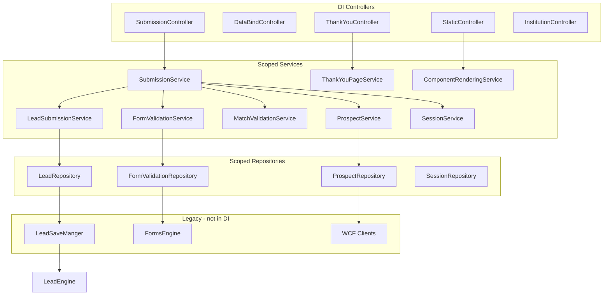

# Dependency Injection

## FormsEngine (SimpleInjector 4.6)

**Registration:** `FormsEngine/EDDY.IS.FormsEngine.Services/Global.asax.cs` → `RegisterDIContainer()`  
**Lifestyle:** `WebRequestLifestyle` (scoped per HTTP request)  
**Resolver:** `SimpleInjectorDependencyResolver` for MVC only

### Scoped Services (30 registrations)

All services and repositories registered as `Lifestyle.Scoped`:

```
ILogoUrlFormattingService → LogoUrlFormattingService
IInstitutionRepository → InstitutionRepository
IInstitutionService → InstitutionService
IFlagService → FlagService
IConfigurationService → ConfigurationService
IFailedMatchReplacementService → FailedMatchReplacementService
IProgramValidationService → ProgramValidationService
IProgramValidationRepository → ProgramValidationRepository
IComponentRenderingService → ComponentRenderingService
IFileReaderService → FileReaderService
IUserSelectionRepository → UserSelectionRepository
IUserSelectionService → UserSelectionService
IMatchValidationService → MatchValidationService
IPAddressService → IPAddressService
ISubmissionService → SubmissionService
IFormValidationService → FormValidationService
IFormValidationRepository → FormValidationRepository
IProspectService → ProspectService
IProspectRepository → ProspectRepository
ILeadSubmissionService → LeadSubmissionService
ILeadRepository → LeadRepository
ILocationValidationService → LocationValidationService
ILocationValidationRepository → LocationValidationRepository
ISessionService → SessionService
ISessionRepository → SessionRepository
IComponentTemplateService → ComponentTemplateService
ITemplatingEngineService → TemplatingEngineService
IProgramService → ProgramService
IProgramRepository → ProgramRepository
IThankYouPageService → ThankYouPageService
IHtmlRenderingStrategyService → HtmlRenderingStrategyService
IHtmlRenderingStrategyRepository → HtmlRenderingStrategyRepository
IMetaDataRepository → MetaDataRepository
IMetaDataService → MetaDataService
ICCPAMessageService → CCPAMessageService
```

### Scoped Controllers (2 only)

```
StaticController
DataBindController
```

### Not Registered (manual instantiation)

- All other 15 controllers use parameterless constructors or `new`
- `FormsEngine` facade: `new FormsEngine()` throughout
- `LeadSaveManger`: static singleton
- `ValidationEngine`: `new Validation.ValidationEngine()`

### Singletons (de facto)

| Instance | Location | Lifetime |
|----------|----------|----------|
| `StaticCacheProxyHost.CacheProxy` | MatchingEngine | App domain (lazy singleton) |
| `LeadSaveManger.leadEngine` | FormsEngine.RF | Static |
| `LeadEngine.dbLeadsService` | LeadEngine | Static |
| `VendorBaseDAO.CacheStore` | VendorWebAPI | Static MemoryCache |
| `RedisHelper` | VendorWebAPI | Static connection |

### Factories

No factory pattern in DI. `RulesEngineFactory` in MatchingEngine uses reflection to discover rule types (not DI-related).

### Hosted / Background Services

**None registered in DI.** Background work via `Task.Run` in `Global.asax.cs` (FormsEngine) and `MatchingService.svc.cs` (MatchingEngine).

---

## MatchingEngine

**No DI container.** Manual instantiation:

```csharp
MatchingEngine engine = new MatchingEngine(pLog);
StaticCacheProxyHost.CacheProxy  // Lazy<MatchingEngineCache>
```

SEO Allocation Console uses constructor injection (only place with interfaces):

```csharp
IAllocationProcessManager allocationProcessManager = new AllocationProcessManager(
    new EddyLoggingDataService(), new EddyTrackingDataService());
```

---

## VendorWebAPI

**No DI container.** All classes use `new`:

```csharp
// CampaignAuthorizationFilter.cs
private VendorCampaigns vendorCampaigns = new VendorCampaigns();
private VendorResponseMessages vendorResponseMessages = new VendorResponseMessages();
private Logs logs = new Logs();
```

---

## DI Dependency Graph (FormsEngine — DI path only)



---

## Configuration Binding

### FormsEngine

- `ConfigurationService` reads `appSettings` and `componentTemplates` config sections
- No `IOptions<T>` pattern (.NET Framework)
- `Settings.cs` provides strongly-typed wrapper (legacy)

### VendorWebAPI

- Direct `ConfigurationManager.AppSettings["key"]` access throughout DAOs and filters
- No options classes

### MatchingEngine

- `StaticSettings.IsBeta` reads `AppSettings["IsBeta"]`
- Cache TTLs read directly from `ConfigurationManager` in `MatchingEngineCache`
