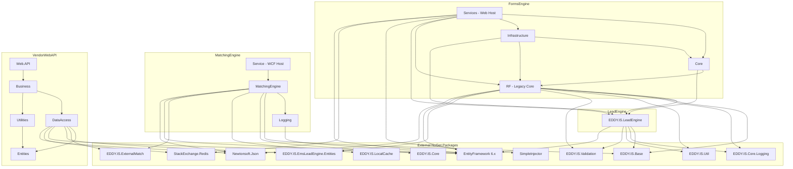
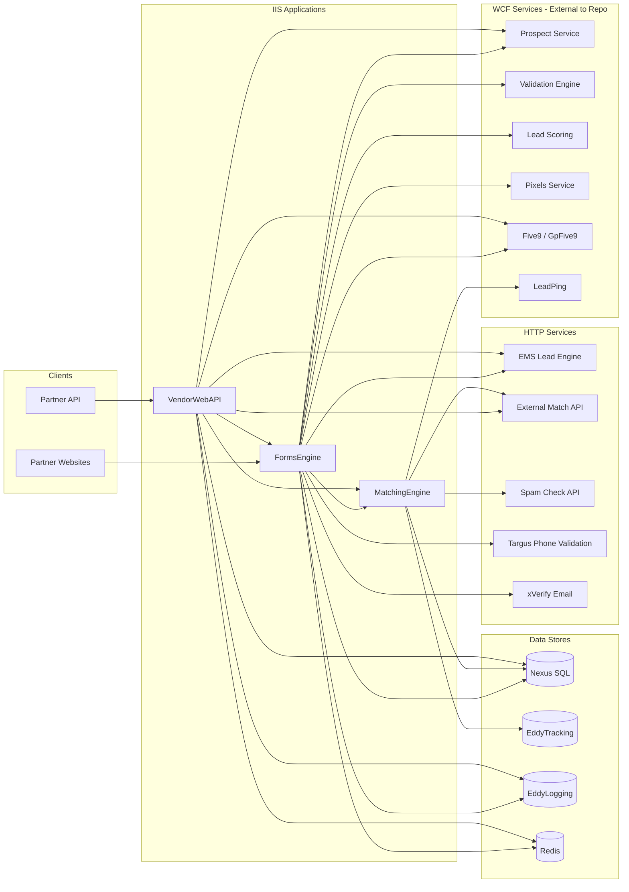
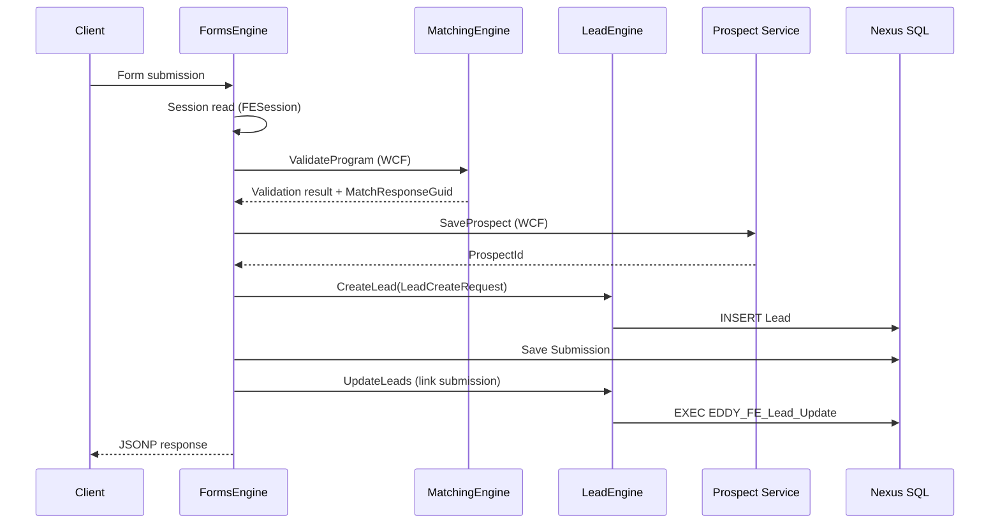
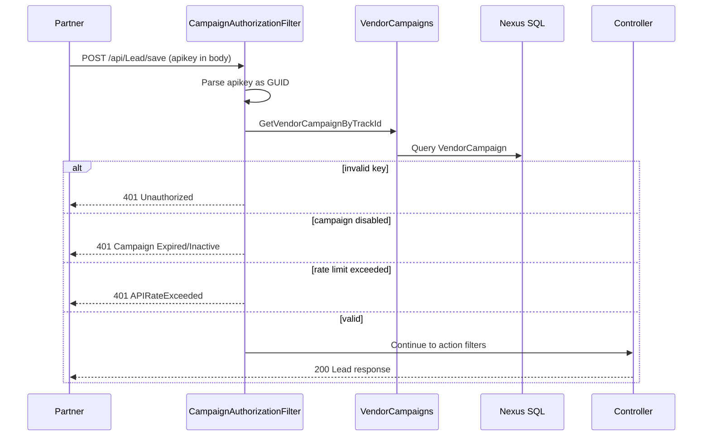
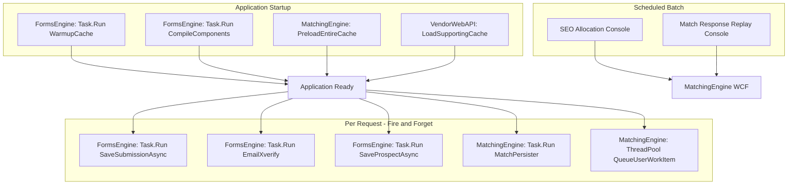
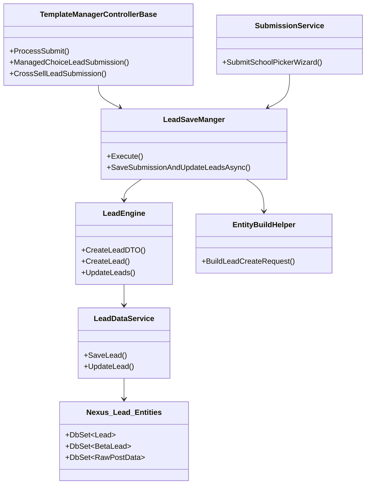
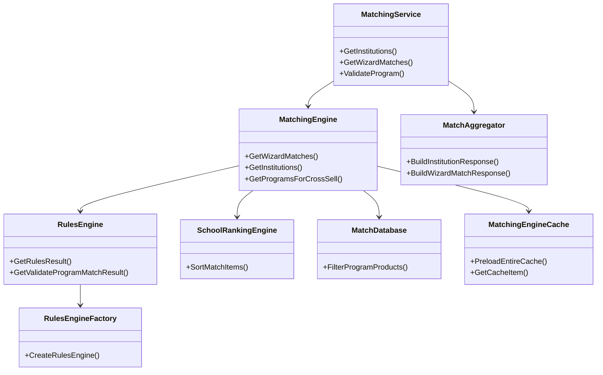
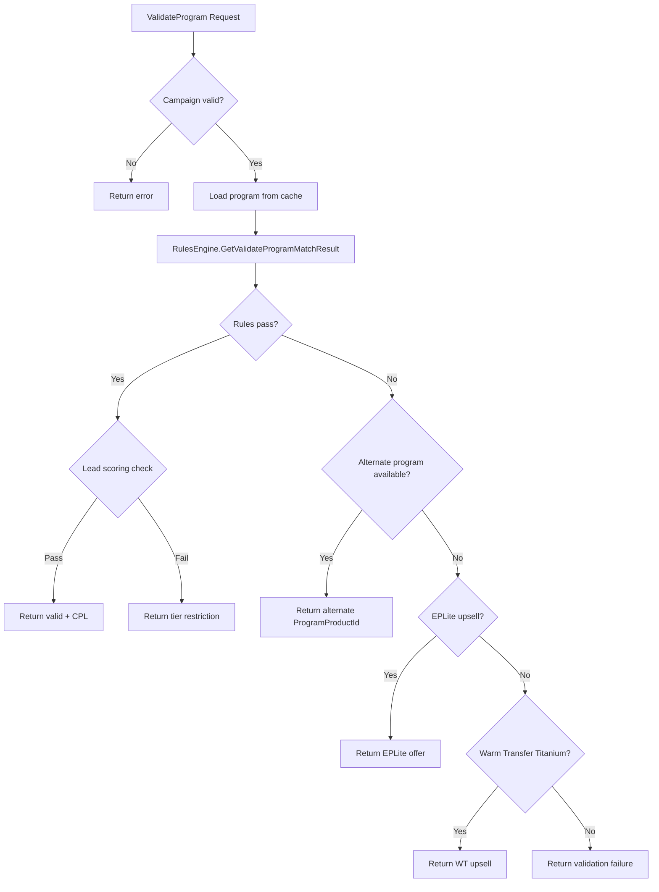

# Diagrams — Dependency Graph

## Solution-Level Dependencies

## Runtime Service Dependencies

## Data Flow — Request Lifecycle

## Authentication Flow (VendorWebAPI)

## Background Processing Flow

## Class Diagram — Lead Creation Pipeline

## Class Diagram — MatchingEngine Core

## Flowchart — Program Validation Decision

