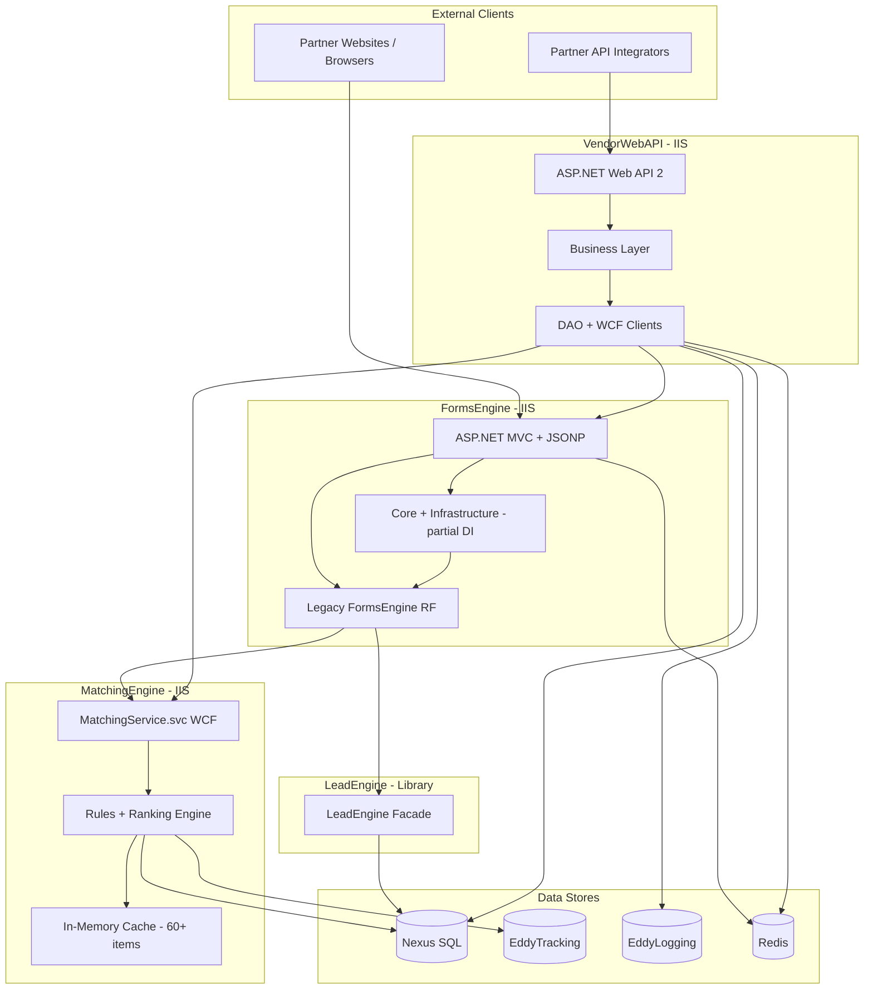

# Executive Summary

> **Documentation scope:** Reverse-engineered from repository at `/workspace` on 2026-07-15.  
> **Confidence:** High for structure and code paths; Medium for production deployment topology (inferred from CI/CD YAML and `Web.config` transforms).

---

## What the Application Does

**EDDY Information Systems (EDDY.IS)** is an education lead-generation platform operated by Education Dynamics. The repository contains four cooperating subsystems that together power online student inquiry forms, program/school matching, lead persistence, and partner (vendor) API access:

| Subsystem | Role |
|-----------|------|
| **FormsEngine** | Serves embedded web forms (program templates, wizards, school picker) to partner sites; validates input; orchestrates matching, prospect creation, and lead submission |
| **MatchingEngine** | Rules-based engine that ranks and filters education programs/institutions for a prospect based on campaign, geography, caps, lead scoring, and business-model criteria |
| **LeadEngine** | Library that normalizes and persists leads to SQL Server (`Nexus.dbo.Lead`) |
| **VendorWebAPI** | Partner-facing REST API for directory browsing, program details, lead/prospect submission, and call-center integrations |

**Source evidence:** Solution files at `FormsEngine/EDDY.IS.FormsEngine.sln`, `MatchingEngine/EDDY.IS.MatchingEngine.sln`, `VendorWebAPI/EDDY.IS.Vendor.Web.API.sln`, and `LeadEngine/EDDY.IS.LeadEngine-RF/`.

---

## Business Problem Solved

Education marketing partners need to:

1. Display configurable inquiry forms on their websites
2. Match prospective students to eligible school/program inventory under campaign rules and revenue caps
3. Capture, validate, and deliver leads to institutions and downstream systems (EMS, dialers, CRM)
4. Expose inventory and submission capabilities to third-party integrators via API

The platform centralizes campaign configuration, matching logic, compliance (TCPA/CCPA), and lead delivery status tracking so partners do not implement this complexity themselves.

---

## Primary Users

| User Type | Interaction |
|-----------|-------------|
| **Prospective students** | Fill forms embedded on partner/aggregator sites (indirect consumers) |
| **Partner web developers** | Embed FormsEngine JavaScript; call VendorWebAPI |
| **Internal operations** | Configure campaigns, templates, caps in Nexus DB (outside this repo) |
| **Call center agents** | Submit leads via `CallCenterLeadController` / Five9 routing |
| **SEO/analytics teams** | Run `EDDY.IS.SEOAllocation.Console` for GradSchools allocation analysis |

---

## Major Workflows

1. **Program template form submission** — `TemplateManager/ProcessSubmit` → validation → matching → prospect → lead save (`FormsEngine/EDDY.IS.FormsEngine.Services/Controllers/Base/TemplateManagerControllerBase.cs`)
2. **Wizard / managed choice** — multi-step school selection with Five9 dialer routing (`GetWizardTemplate` → `ManagedChoiceLeadSubmission`)
3. **School Picker wizard** (newer DI path) — `Submission/SubmitSchoolPickerWizard` via `SubmissionService` (`FormsEngine/EDDY.IS.FormsEngine.Core/Services/SubmissionService.cs`)
4. **Directory/matching** — VendorWebAPI → WCF MatchingEngine → cached rules engine (`MatchingEngine/EDDY.IS.MatchingEngine/MatchingEngine.cs`)
5. **Partner lead API** — VendorWebAPI `Lead/save` → FormsEngine WCF → LeadEngine persistence
6. **SEO allocation batch** — Drupal sitemap nodes → `GetInstitutions` → allocation DB (`MatchingEngine/EDDY.IS.SEOAllocation.Console/`)

See [BusinessProcesses.md](./BusinessProcesses.md) for detailed sequence diagrams.

---

## Major Integrations

| System | Protocol | Consumer |
|--------|----------|----------|
| SQL Server **Nexus** | EF6 / ADO.NET | All subsystems |
| SQL Server **EddyTracking** / **EddyLogging** | EF6 | MatchingEngine logging, VendorWebAPI API logs |
| **Matching Engine** (WCF) | SOAP/JSON | FormsEngine, VendorWebAPI |
| **Prospect Service** (WCF) | SOAP | FormsEngine, VendorWebAPI |
| **Validation Engine** (WCF) | SOAP | FormsEngine |
| **Lead Scoring Service** (WCF) | SOAP | FormsEngine |
| **Five9 / GpFive9** (WCF) | SOAP | FormsEngine, VendorWebAPI |
| **EMS Lead Engine** (HTTP) | REST + auth token | FormsEngine, VendorWebAPI |
| **LeadPing** (WCF) | SOAP | MatchingEngine rules |
| **External Match** (HTTP) | REST | MatchingEngine, VendorWebAPI |
| **Redis** | StackExchange.Redis | FormsEngine sessions, VendorWebAPI match cache |
| **Targus / EmailVerify / xVerify** | SOAP/HTTP | FormsEngine validation |

Endpoint references: `FormsEngine/EDDY.IS.FormsEngine.Services/Web.config` (`system.serviceModel`), `VendorWebAPI/EDDY.IS.Vendor.Web.API/Web.config`.

---

## High-Level Architecture

---

## Technology Stack

| Layer | Technology |
|-------|------------|
| Runtime | .NET Framework 4.5.1 – 4.8 |
| Web hosts | ASP.NET MVC 5, ASP.NET Web API 2, WCF |
| ORM | Entity Framework 6 (Database First / EDMX) |
| DI | SimpleInjector 4.6 (FormsEngine only, partial) |
| Caching | `HttpRuntime.Cache`, `System.Runtime.Caching`, `EDDY.IS.LocalCache`, Redis |
| Serialization | Newtonsoft.Json 13.x |
| Templating | RazorEngine 3.x |
| Testing | xUnit, MSTest, Moq, FluentAssertions |
| CI/CD | Azure DevOps Pipelines (Windows agents, IIS deploy) |

---

## Deployment Model

- **Hosting:** IIS on Windows Server (`F:\inetpub\wwwroot\...`)
- **App pools:** `EDDY.IS.FormsEngine.Service`, `EDDY.IS.MatchingEngine.Service`, `CheetahPool` (VendorWebAPI)
- **Branches:** `development`, `qa`, `uat`, `main` trigger full CI/CD (`azure-pipelines.yaml`)
- **Feature branches:** CI-only builds (`ci-pipelines.yaml`)
- **Configuration:** `Web.config` + environment transforms (`Master.config`, `Web.NonProd.config`); token replacement for DB servers and service URLs
- **No Docker/Kubernetes** in this repository

---

## Strengths

1. **Mature matching domain** — Extensive rules engine with caps, geo, lead scoring, warm transfer, and school ranking algorithm (SRA)
2. **Heavy in-memory caching** — MatchingEngine preloads 60+ cache items for sub-second match responses
3. **Clear partner API surface** — VendorWebAPI with campaign authorization and rich validation filters
4. **Incremental modernization** — FormsEngine School Picker path uses Core/Infrastructure/DI pattern
5. **Shared NuGet platform** — `EDDY.IS.Base`, `EDDY.IS.Core`, `EDDY.IS.Validation` provide cross-cutting concerns

---

## Weaknesses

1. **Legacy .NET Framework** — No ASP.NET Core migration path started; WCF dependencies throughout
2. **Inconsistent architecture** — FormsEngine runs dual stacks (legacy `FormsEngine` partial class + new DI services)
3. **No application-level auth on FormsEngine/MatchingEngine** — Relies on network perimeter
4. **Manual instantiation** — VendorWebAPI and most of MatchingEngine use `new` instead of DI
5. **GET-based mutations** — FormsEngine uses GET + JSONP for form submissions (CSRF/cache concerns)
6. **Fire-and-forget async** — `Task.Run` for lead saves and logging without structured error handling
7. **Tests disabled in CI** — MatchingEngine pipeline comments out `VSTest@3`

---

## Technical Debt (Prioritized Themes)

| Theme | Evidence | Impact |
|-------|----------|--------|
| God classes | `TemplateManagerControllerBase` (~1800+ lines), `FormsEngine` partial across multiple files | Maintainability |
| Typo in project name | `EDDY.IS.FormsEngine.Infastructure` | Confusion for new developers |
| Orphan projects | `FormsEngine.Business`, `FormsEngine.Entities` not in solution | Dead/transition code |
| MongoDB experiment | `EDDY.IS.MatchingEngine.MongoDB` not referenced | Dead code |
| WCF everywhere | All inter-service communication | Modernization blocker |
| Secrets in config | `EmsLeadEngineAuthToken`, API keys in `Web.config` | Security risk |
| No correlation IDs | Logging via `ISException` without request tracing | Observability gap |

See [Refactoring/Recommendations.md](./Refactoring/Recommendations.md) for ranked remediation plan.
