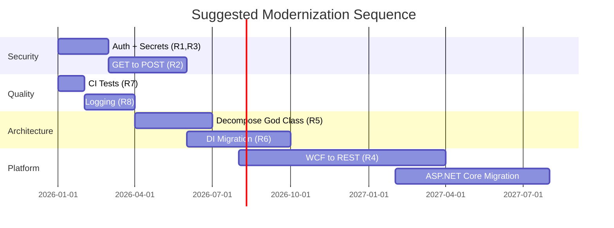

# Refactoring Recommendations

Ranked by business and technical impact. Effort estimates are relative (S/M/L/XL), not calendar-based.

---

## Priority 1 — Critical

### R1: Add Authentication to Public Endpoints

| Attribute | Value |
|-----------|-------|
| **Problem** | FormsEngine (80+ endpoints) and MatchingEngine WCF have no auth; LeadDetails MVC unprotected |
| **Risk** | Data breach, unauthorized lead submission, cache manipulation |
| **Effort** | M |
| **Business Impact** | Compliance, partner trust |
| **Technical Impact** | Enables safe internet exposure |
| **Implementation** | API key middleware for FormsEngine; mutual TLS or API key for ME WCF; auth on LeadDetails |
| **Priority** | P1 |

### R2: Migrate GET Mutations to POST

| Attribute | Value |
|-----------|-------|
| **Problem** | `ProcessSubmit`, `SaveProspect`, `ManagedChoiceLeadSubmission` use HTTP GET |
| **Risk** | CSRF, browser prefetch attacks, proxy caching of mutations |
| **Effort** | L |
| **Business Impact** | Partner JS must be updated (breaking change) |
| **Technical Impact** | Eliminates largest security vulnerability |
| **Implementation** | Add POST endpoints; maintain GET as deprecated alias during transition |
| **Priority** | P1 |

### R3: Extract Secrets to Key Vault

| Attribute | Value |
|-----------|-------|
| **Problem** | Auth tokens, API keys in plaintext Web.config |
| **Risk** | Credential exposure via config file access |
| **Effort** | S |
| **Business Impact** | Compliance (SOC2, PCI adjacent) |
| **Technical Impact** | Centralized secret rotation |
| **Implementation** | Azure Key Vault provider for .NET Framework; environment variable fallback |
| **Priority** | P1 |

---

## Priority 2 — High

### R4: Migrate WCF to ASP.NET Core REST/gRPC

| Attribute | Value |
|-----------|-------|
| **Problem** | All inter-service communication via WCF (deprecated technology) |
| **Risk** | Cannot deploy to Linux/containers; no modern tooling support |
| **Effort** | XL |
| **Business Impact** | Enables cloud migration and cost reduction |
| **Technical Impact** | Foundation for all other modernization |
| **Implementation** | Start with MatchingEngine (most consumed); OpenAPI contract; parallel run |
| **Priority** | P2 |

### R5: Decompose TemplateManagerControllerBase

| Attribute | Value |
|-----------|-------|
| **Problem** | ~1800-line god class containing submission, matching, prospect, lead, pixel logic |
| **Risk** | Any change risks regression; untestable |
| **Effort** | L |
| **Business Impact** | Faster feature delivery |
| **Technical Impact** | Enables unit testing of submission pipeline |
| **Implementation** | Extract `FormSubmissionOrchestrator`, `WizardSubmissionOrchestrator`, `CrossSellOrchestrator` services |
| **Priority** | P2 |

### R6: Complete FormsEngine DI Migration

| Attribute | Value |
|-----------|-------|
| **Problem** | Only School Picker uses DI; legacy path uses static singletons |
| **Risk** | Two parallel codepaths; inconsistent testability |
| **Effort** | L |
| **Business Impact** | Reduced bug rate in form submission |
| **Technical Impact** | Single architecture pattern |
| **Implementation** | Register all services in SimpleInjector; inject into controllers; deprecate static `FormsEngine` facade |
| **Priority** | P2 |

### R7: Enable CI Test Execution

| Attribute | Value |
|-----------|-------|
| **Problem** | MatchingEngine tests commented out in CI; low coverage overall |
| **Risk** | Regressions ship to production |
| **Effort** | S |
| **Business Impact** | Quality assurance |
| **Technical Impact** | Safety net for refactoring |
| **Implementation** | Uncomment VSTest in pipeline; add FormsEngine/VendorWebAPI test stages |
| **Priority** | P2 |

---

## Priority 3 — Medium

### R8: Introduce Structured Logging with Correlation IDs

| Attribute | Value |
|-----------|-------|
| **Problem** | `ISException` logging without request correlation across WCF calls |
| **Risk** | Cannot trace end-to-end submission failures |
| **Effort** | M |
| **Implementation** | Add correlation ID middleware; propagate through WCF headers; Application Insights |
| **Priority** | P3 |

### R9: Replace Fire-and-Forget Task.Run with Queue

| Attribute | Value |
|-----------|-------|
| **Problem** | Lead saves and logging via `Task.Run` with swallowed exceptions |
| **Risk** | Silent data loss |
| **Effort** | M |
| **Implementation** | Azure Service Bus or Hangfire for lead save and match logging |
| **Priority** | P3 |

### R10: Consolidate Caching Strategy

| Attribute | Value |
|-----------|-------|
| **Problem** | HttpRuntime.Cache + MemoryCache + Redis + LocalCacheBase + ME in-memory |
| **Risk** | Cache coherence bugs; memory pressure |
| **Effort** | M |
| **Implementation** | Standardize on Redis for distributed cache; in-memory for ME hot path only |
| **Priority** | P3 |

### R11: Remove Orphan Projects

| Attribute | Value |
|-----------|-------|
| **Problem** | 10+ projects not in solutions (Business, Entities, MongoDB, TestSplitSimulator, etc.) |
| **Risk** | Developer confusion |
| **Effort** | S |
| **Implementation** | Archive or delete unused projects; add remaining to solution |
| **Priority** | P3 |

### R12: Rename Infastructure → Infrastructure

| Attribute | Value |
|-----------|-------|
| **Problem** | Typo in project name |
| **Effort** | S (but breaking for all references) |
| **Priority** | P3 |

---

## Priority 4 — Low

### R13: Migrate EF6 Database First to Dapper/Code First

| Attribute | Value |
|-----------|-------|
| **Problem** | EDMX models require Visual Studio to update; no migration history |
| **Effort** | XL |
| **Priority** | P4 |

### R14: Upgrade jQuery and Legacy Frontend

| Attribute | Value |
|-----------|-------|
| **Problem** | jQuery 1.10.2 in VendorWebAPI; bundled wizard JS not modularized |
| **Effort** | L |
| **Priority** | P4 |

### R15: Implement ProspectResubmit Console

| Attribute | Value |
|-----------|-------|
| **Problem** | Empty `Main()` in `EDDY.IS.ProspectResubmit` |
| **Effort** | M |
| **Priority** | P4 |

---

## Modernization Roadmap (Suggested Sequence)

**Note:** Timeline is illustrative for sequencing only, not calendar estimates.
