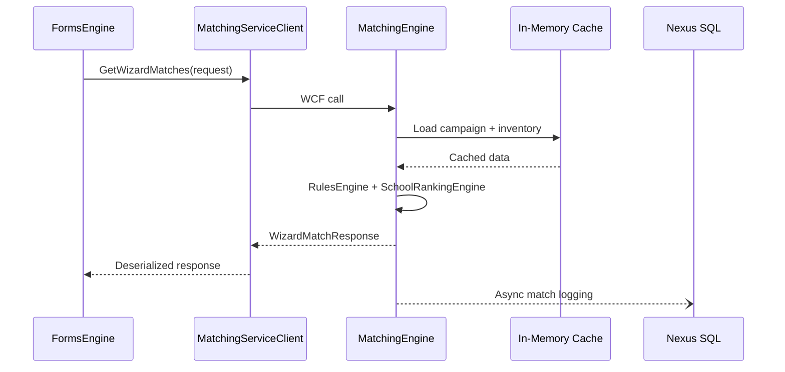

# Integrations

## Integration Map

| System | Protocol | Auth | Consumer | Config Key / Endpoint |
|--------|----------|------|----------|----------------------|
| Matching Engine | WCF/SOAP + JSON | None | FormsEngine, VendorWebAPI | `system.serviceModel/client` |
| Forms Engine | WCF/SOAP | None | VendorWebAPI | `FormsEngineAPI.svc` |
| Prospect Service | WCF/SOAP | None | FormsEngine, VendorWebAPI | `ProspectService.svc` |
| Validation Engine | WCF/SOAP | None | FormsEngine | `ValidationService.svc` |
| Lead Scoring Service | WCF/SOAP | None | FormsEngine | `LeadScoringService.svc` |
| Pixels Service | WCF/SOAP | None | FormsEngine | `PixelsService.svc` |
| Five9 Service | WCF/SOAP | None | FormsEngine | `Five9Service.svc` |
| GpFive9 Service | WCF/SOAP | None | VendorWebAPI | `GpFive9Service.svc` |
| LeadPing | WCF/SOAP | None | FormsEngine, MatchingEngine | `LeadPingService.svc` |
| EMS Lead Engine | HTTP REST | Auth token header | FormsEngine, VendorWebAPI | `EmsLeadEngineCreateFromISUrl` |
| External Match | HTTP REST | Unknown | MatchingEngine, VendorWebAPI | `ExternalMatchProviderServiceURL` |
| Spam Check | HTTP REST | Unknown | MatchingEngine | `SpamCheckServiceURL` |
| Targus | SOAP | Unknown | FormsEngine | `webapp.targusinfo.com` |
| EmailVerify (Cobisi) | Library | N/A | FormsEngine | NuGet package |
| xVerify | HTTP | Unknown | FormsEngine | `EmailXVerifyURL` |
| Redis | TCP | Connection string | FormsEngine, VendorWebAPI | `RedisServer` / `RedisConnection` |
| GradSchools Drupal | HTTP REST | Unknown | SEO Allocation | `GS_URL` |
| Google Places | HTTP REST | API key | FormsEngine | `GooglePlacesAPIKey` |
| Creative Portal | HTTP | N/A | FormsEngine, LeadEngine | `CreativePortalUrl` |

---

## Detailed Integration: Matching Engine

**Client classes:**
- FormsEngine: `MatchingServiceClient` in `FormsRelatedServices.MatchingEngine.cs`
- VendorWebAPI: `MatchingServiceDAO.cs`

**Key operations called:**
- `GetInstitutions`, `GetPrograms`, `GetWizardMatches`, `ValidateProgram`, `GetProgramsForCrossSell`, `GetFacetedNavigation`

**Retry logic:** None (WCF default binding behavior only)  
**Failure handling:** Exceptions bubble to controller; logged via `ISException`  
**Rate limits:** None at client level

---

## Detailed Integration: EMS Lead Engine

**Client:** `FormsRelatedServices.EmsLeadEngine.cs` (FormsEngine), `DataExchangeServiceDAO.cs` (VendorWebAPI)

**Auth:** `EmsLeadEngineAuthToken` in request header  
**Endpoints:**
- Create: `EmsLeadEngineCreateFromISUrl`
- Update: `EmsLeadEngineProcessFromDataExchangeEndpoint`

**Failure handling:** Logged; does not block lead save response  
**Timeout:** `EmsLeadEngineTimeoutMinutes` (VendorWebAPI)

---

## Detailed Integration: LeadPing

**Used by:** MatchingEngine `LeadPing` rule, FormsEngine lead scoring

**Protocol:** WCF BasicHttp  
**Endpoint:** `http://leadping.{env}.educationdynamics.local/V3/Service.svc`  
**Purpose:** Lead scoring tier lookup, CPL determination

---

## Detailed Integration: External Match

**NuGet:** `EDDY.IS.ExternalMatch` 1.0.0-ci, `EDDY.IS.ExternalMatch.Base`

**Client:** `ExternalMatchServiceClient.cs` (MatchingEngine), `FormsServiceDAO` (VendorWebAPI)

**Purpose:** Third-party smart match integration; EduMax external match items  
**Caching:** Redis in VendorWebAPI (`ExternalMatchItemGuid`)

---

## Detailed Integration: Redis

**Library:** StackExchange.Redis (1.2.6 – 2.5.61 across projects)

**Uses:**
- FormsEngine: Session extension beyond ASP.NET Cache
- VendorWebAPI: Match result caching, microsite program/campus caching
- MatchingEngine.MongoDB (unused): Experimental cache offload

**Config:** `RedisServer` / `RedisConnection`, `RedisCachePrefix`, `RedisCacheDurationInMinutes`

---

## Detailed Integration: Validation Services

| Service | Mechanism | Used For |
|---------|-----------|----------|
| ValidationEngine (NuGet) | WCF + local cache | Email, phone, zip, profanity, city/state |
| Targus | SOAP web service | Phone validation |
| EmailVerify (Cobisi) | NuGet library | DNS/MX email verification |
| xVerify | HTTP async | Extended email verification |
| Spam Check | HTTP POST | EMS spam detection (MatchingEngine rule) |
